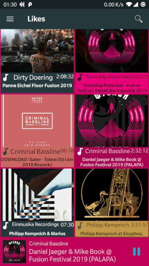

## SoundCrowd music player for android

SoundCrowd is a free, easy, and lightweight music player in new and modern Android material design specialized for playback of long music files (DJ mix, live sets, audio books).

The primary feature of SoundCrowd is the generation of waveforms that visualize your music files while playback and can be used for precise seeking through gestures. With this you can navigate very quickly and easy to the positions you like even in very long mix sets and on smaller display sizes.

SoundCrowd allows you to create cue points inside music tracks. With the star symbol you can mark your favorite parts in current track to be able to find it later again easily. To jump to a point, push the star symbol that appears on the waveform. To delete a point, simply push long on the point.

SoundCrowd is extensible via plugins to support online media providers.

## Download

## Screenshots
 

## License
SoundCrowd and its modules are licensed under GPLv3.
